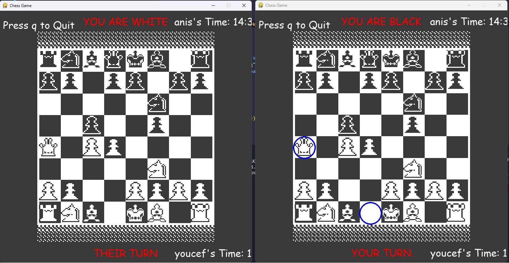

# Multiplayer-Online-Game-with-Python-Pygame
This project is a two-player game built using Python and Pygame that allows players to connect and play online or locally. Spectators can also view the game in real-time. The game is still in development and some bugs remain, with planned improvements.


---
## Features
- Two-player online or local gameplay.
- Spectator mode to watch live games.
- Simple registration for players.
## Requirements
- **Python 3.x**
- Pygame
```
pip install pygame
```
-Socket programming
---
## How to Run
1. Start the server.
2. Open a new terminal and run the game file to register the first player.
3. Run the game file again to register the second player.
4. Players 1 and 2 will have separate game windows to start the match.
---
## Future Improvements
- Bug Fixes: Occasional disconnections and synchronization issues between players.
- Enhanced Spectator Mode: Allow multiple spectators and smoother game transitions.
- Scoreboard: Add a real-time scoreboard to track wins and losses.
- Chat: In-game chat system between players and spectators.
---
## Known Bugs
- Connection Issues: Players may disconnect unexpectedly when transitioning between moves.
- Game Logic: Some moves might not register properly during gameplay.
- Spectator Switching: Spectators may face glitches when switching between games.
---
## How to Play Online
To play online, run the server on a machine with a public IP, and specify the IP and port in game.py before running it on different machines.

---

## License
 - This project is open-source and free to use under the MIT license.
